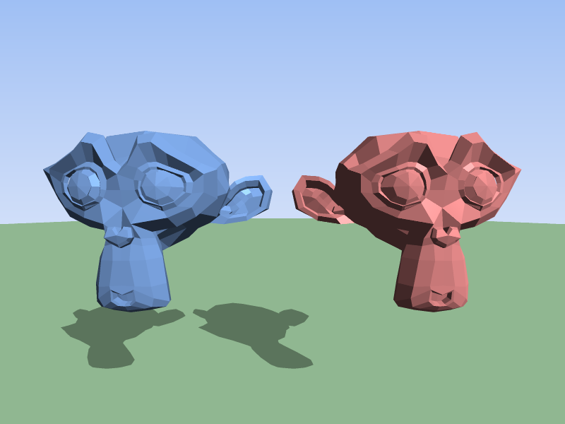
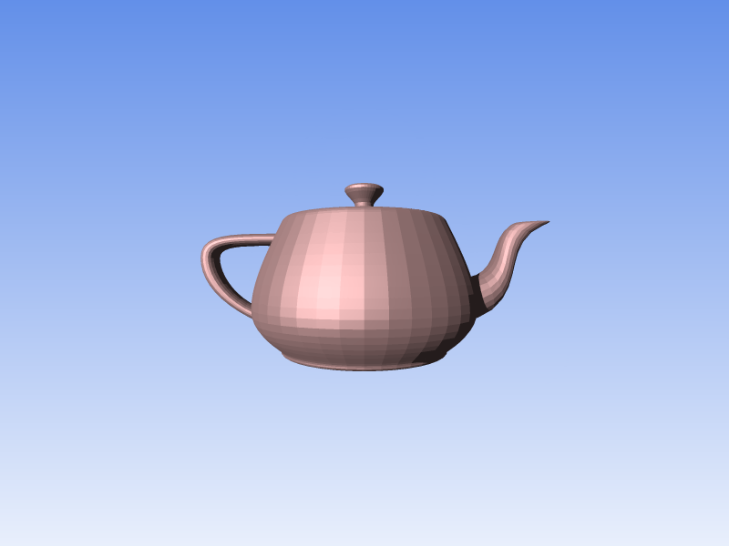

# HOW TO USE
The website renders the default scene when you load it.

### - Adding Models
The project contains a folder with some example .obj files, these are named with
the approximate time they take to render with nothing else on the screen and with 
their default position and scale.
You can add the files by dragging them into the upload area, or by clicking "Choose File".
By default an object is added into the scene, this can be removed or edited.
You can add objects into the scene by clicking "➕" in the object dropdown.

### - Object Dropdown
You can open the "➤ Sphere" dropdown to access all the spheres in the scene,
as more 3d models are added more object dropdowns will appear, if more are added
then can fit in the box you can scroll.

### - Editing Objects
When you open the dropdown a table appears showing the values for each of that object,
you can edit the values for position, scale and colour.
You can also remove objects.

### - Generate
The generate button will render the scene again.
Before the anti-aliasing, it will estimate how long the anti-aliasing might take,
when the render is finished it will tell you the total time since clicking the button.

# THE CODE
The code is separated into 8 sections.

**\[1\] VECTOR CLASS         Ln\. 81**

**\[2\] OBJECT CLASSES       Ln\. 163**

**\[3\] RAYS                 Ln\. 393**

**\[4\] CALCULATE COLOUR     Ln\. 503**

**\[5\] OBJ TO SCENE         Ln\. 578**

**\[6\] GUI                  Ln\. 662**

**\[7\] UPLOADING OBJ FILE   Ln\. 876**

**\[8\] MAIN                 Ln\. 928**

### VECTOR CLASS
This stores the x, y, z values of a 3d vector, and contains methods for manipulating and creating new vectors.

### OBJECT CLASSES
These store the information for the objects in the scene.
They contain functions to check for ray intersections with themselves.
It contains a sphere class, and an object class.
The object class is made from triangle classes, and also an AABB class which helps with optimizations
by checking if a ray intersects the bounding box of the 3d object.

### RAYS
Performs ray intersection checks on all objects in the scene.
Also performs checks to see if a hit point is in shade.
Will return a hit or miss with information about the point including the normals and inShade.

### CALCULATE COLOUR
This is responsible for calculating the colour of a pixel (or fraction of a pixel) and setting it.
Uses Phong shading, ambience, diffuse, specular highlights.
Also applies shadows and colour correction.

### OBJ TO SCENE
Will take an obj file, and will parse it to find the vertices, faces and normals of a 3d object.
It will create a new object type and fill it with an array of triangles.

### GUI
Handles the interface, will keep track of the objects data that's been input.

### UPLOADING OBJ FILE
This will listen for object drop event on the drop zone, and also check if a file is uploaded using the button.
It will extract the file information and add it to an uploadedModels array.
It will also extract the file name and use it to create a new object dropdown.

### MAIN
Where the rendering happens.
The render is split into chunks so you can see the progress of it, it will loop over each chunk
and set the colour of each pixel.

It will then run an edge detection algorithm in order to only anti-alias areas that need it.
After the edge-detection it will create an estimated time for how long the anti-aliasing should take.
After the anti-aliasing is finished the render is done and it will show the total time taken from the start.

# Examples

Example renders of **Suzanne** by **Willem-Paul van Overbruggen** and the **Utah teapot** by **Martin Newell.**